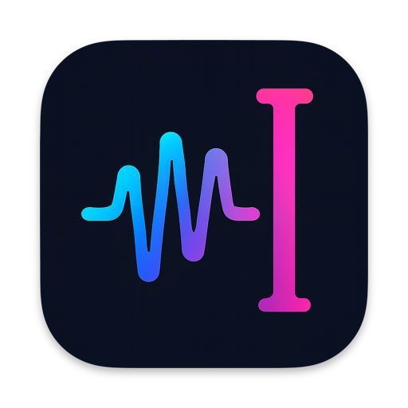

# VTS - Voice Typing Studio
<p align="center">
  
  <br>
  <strong>The open-source macOS dictation replacement you've been waiting for! 🚀</strong>
</p>

> **🔊 Turn on your sound!** This demo includes audio to showcase the real-time transcription experience.

https://github.com/user-attachments/assets/bc77c14b-863c-418f-8564-175d6300ce2b

<p align="center">
  <strong>🚀 Sub-second dictation. BYO key. Types where your cursor is.</strong>
</p>

---

<p align="center">
  <a href="https://github.com/j05u3/VTS/releases/latest">
    
  </a>
</p>

<p align="center">
  <strong>Or install with Homebrew:</strong>
</p>

```bash
brew install j05u3/tap/voice-typing-studio
```

<p align="center">
  <!-- Social and Community Badges -->
  <a href="https://github.com/j05u3/VTS/stargazers"></a>
  <a href="https://github.com/j05u3/VTS/network/members"></a>
  <br>
  <!-- Status and Release Badges -->
  <a href="https://github.com/j05u3/VTS/releases/latest"></a>
  <a href="https://github.com/j05u3/VTS/releases"></a>
  <a href="https://opensource.org/licenses/MIT"></a>
  <br>
  <!-- Development Activity Badges -->
  <a href="https://github.com/j05u3/VTS/actions/workflows/build-and-distribute.yml"></a>
  <a href="https://github.com/j05u3/VTS/issues"></a>
  <a href="https://github.com/j05u3/VTS/pulls"></a>
  <br>
  <!-- Platform Badge -->
  <a href="https://developer.apple.com/macos/"></a>
</p>

---

Transform your voice into text instantly with the power of **OpenAI**, **Groq**, and **Deepgram** APIs. Say goodbye to macOS dictation limitations and hello to lightning-fast, accurate transcription with your own custom hotkeys! ⚡️

## 📋 Table of Contents

- [Why Choose VTS?](#-why-choose-vts)
- [API Key Setup](#api-key-setup)
- [Usage Guide](#-usage-guide)
  - [Basic Transcription](#basic-transcription)
  - [Advanced Features](#advanced-features)
- [Longer Demo](#-longer-demo)
- [Screenshots](#-screenshots)
- [Privacy & Security](#-privacy--security)
- [Troubleshooting](#-troubleshooting)
- [Development](#-development)
  - [Requirements](#development-requirements)
  - [Building from Source](#building-from-source)
  - [Architecture](#architecture)
  - [Contributing](#contributing)
- [Roadmap](#-roadmap)
- [Feedback](#-feedback)
- [License](#-license)
- [Acknowledgements](#-acknowledgements)

## ✨ Why Choose VTS?

- 🤖 **AI-Powered Accuracy**: Leverage OpenAI, Groq, and Deepgram models for superior transcription
- 🔑 **Your Keys, Your Control**: Bring your own API keys - no subscriptions, no limits
- 🔄 **Drop-in Replacement**: Works exactly like macOS dictation, but better!
- ⌨️ **Your Shortcut, Your Rules**: Fully customizable global hotkeys (default: ⌘⇧;)
- 🎯 **Smart Device Management**: Intelligent microphone priority with seamless fallback
- 💬 **Context-Aware**: Custom system prompt boosts accuracy for your specific needs  
- 🔓 **100% Open Source**: Full transparency, community-driven, modify as you wish

## API Key Setup

After installing VTS, you'll need an API key from one of these providers:

- **OpenAI**: [Get your API key here](https://platform.openai.com/api-keys)
- **Groq**: [Get your API key here](https://console.groq.com/keys)
- **Deepgram**: [Get your API key here](https://console.deepgram.com/project/keys)

*Only one API key is required - choose the provider you prefer!*

**Requirements:**
- **macOS 14.0+** (Apple Silicon & Intel supported)
- **API key** from OpenAI, Groq, or Deepgram

## 📖 Usage Guide

### Basic Transcription
1. **Choose Provider**: Select OpenAI, Groq, or Deepgram from the dropdown
2. **Select Model**: Pick whisper-1, whisper-large-v3, or other available models
3. **Enter API Key**: Paste your API key in the secure field
4. **Start Recording**: Press the global hotkey (default: ⌘⇧;) and speak
5. **View Results**: See real-time transcription inserted into the application you're using
6. **(Optional) Copy**: Use buttons to copy the transcript

### Advanced Features

#### Microphone Priority Management
- **View Available Devices**: See all connected microphones with system default indicators
- **Set Priority Order**: Add devices to priority list with + buttons
- **Automatic Fallback**: App automatically uses highest-priority available device
- **Real-time Switching**: Seamlessly switches when preferred devices connect/disconnect
- **Remove from Priority**: Use − buttons to remove devices from priority list

#### Custom System Prompts
- Add context-specific prompts to improve transcription accuracy
- Examples: "Medical terminology", "Technical jargon", "Names: John, Sarah, Mike"
- Prompts help the AI better understand domain-specific language

## 🎬 Longer Demo

https://github.com/user-attachments/assets/f69c365a-4f1a-42f1-b2de-66d61643fea0

Onboarding:

https://youtu.be/NTQmVCvkZQQ

## 📷 Screenshots

 
 


## 🔒 Privacy & Security

- **No audio storage**: Audio is processed in real-time, never stored locally
- **API keys are safe**: Keys are stored in Keychain
- **TLS encryption**: All API communication uses HTTPS
- **Microphone permission**: Explicit user consent required for audio access
- **Basic telemetry**: We collect minimal usage analytics in compliance with GDPR regulations

## 🛠️ Troubleshooting

### Common Issues
- **Microphone Permission Denied**: Check System Settings > Privacy & Security > Microphone
- **No Microphones Found**: Click "Refresh" in the Microphone Priority section
- **Wrong Microphone Active**: Set your preferred priority order or check device connections
- **App Not Responding to Hotkey**: Ensure accessibility permissions are granted when prompted

---

## 👩‍💻 Development

*This section is for developers who want to build VTS from source or contribute to the project.*

### Development Requirements
- **macOS 14.0+** (Apple Silicon & Intel supported)
- **Xcode 15+** for building
- **API key** from OpenAI, Groq, or Deepgram for testing

### Building from Source

1. **Clone the repository:**
```bash
git clone https://github.com/j05u3/VTS.git
cd VTS
```

2. **Open in Xcode:**
```bash
open VTSApp.xcodeproj
```

3. **Build and run:**
   - In Xcode, select the **VTSApp** scheme
   - Build and run with **⌘R**
   - Grant microphone permission when prompted

#### Command Line Building

```bash
# Build via command line
xcodebuild -project VTSApp.xcodeproj -scheme VTSApp build
```

### Architecture

VTS follows a clean, modular architecture:

- **CaptureEngine**: Handles audio capture using AVAudioEngine with Core Audio device management
- **DeviceManager**: Manages microphone priority lists and automatic device selection
- **TranscriptionService**: Orchestrates streaming transcription with provider abstraction
- **STTProvider Protocol**: Clean interface allowing easy addition of new providers
- **Modern SwiftUI**: Reactive UI with proper state management and real-time updates

### Testing

Currently, VTS includes manual testing capabilities through the built-in Text Injection Test Suite accessible from the app's interface. This allows you to test text insertion functionality across different applications.

Automated unit tests are planned for future releases.

### Development Troubleshooting

#### Accessibility Permissions (Development)
- **Permission Not Updating**: During development/testing, when the app changes (rebuild, code changes), macOS treats it as a "new" app
- **Solution**: Remove the old app entry from System Settings > Privacy & Security > Accessibility, then re-grant permission
- **Why This Happens**: Each build gets a different signature, so macOS sees it as a different application
- **Quick Fix**: Check the app list in Accessibility settings and remove any old/duplicate VTS entries

#### Testing Onboarding Flow
- **Reset App State**: To test the complete onboarding flow, change the `PRODUCT_BUNDLE_IDENTIFIER` in Xcode project settings
- **Why This Works**: Changing the bundle identifier creates a "new" app from macOS perspective, resetting all permissions and app state
- **Most Reliable Method**: This is more reliable than clearing UserDefaults and ensures a clean onboarding test including all system permissions

### Contributing

See [CONTRIBUTING.md](CONTRIBUTING.md) for details on how to contribute to VTS development.

---

## 🗺️ Roadmap

- [x] **Auto-open at login**: Auto-open at login with checkbox in the preferences window (✅ Implemented)
- [x] **Modern Release Automation**: Automated releases with release-please and GitHub Actions (✅ Implemented)
- [x] **Sparkle Auto-Updates**: Automatic app updates with GitHub Releases appcast hosting (✅ Implemented)
- [x] **Support real-time API**: OpenAI Real-time Transcription API (✅ Implemented)


### In a future or maybe pro version, to be decided/ordered by priority, your feedback and contributions are welcome!

- [ ] **More models/providers**: Support for more STT providers like Google, Azure, etc.
- [ ] **Safe auto-cut**: Auto-cut to maximum time if the user forgets to end (or accidentally starts). But also we could use VAD from real-time APIs?
- [ ] **LLM step**: Use LLM to process the transcription and improve accuracy, maybe targetted to the app you're using or context in general. (Be able to easily input emojis?). I mean apply transformations based on the app you're injecting text to.
- [ ] **Advanced Audio Processing**: Noise reduction and gain control, but also some STT providers can do this so maybe not needed?
- [ ] **Comprehensive Test Suite**: Automated unit tests covering:
  - Core transcription functionality
  - Provider validation and error handling  
  - Device management and priority logic
  - Integration flows and edge cases
- [ ] **Accessibility Features**

## 💬 Feedback

Have feedback, suggestions, or issues? We'd love to hear from you! 

**📧 [Send us your feedback](mailto:josueajc@gmail.com?subject=[VTS%20Feedback]%20Your%20thoughts%20on%20VTS)** - Quick and direct way to reach us

You can also:
- 🐛 [Report bugs or request features](https://github.com/j05u3/VTS/issues) on GitHub
- 💡 Share your ideas for improvements
- ⭐ Star the project if you find it useful!

## 📄 License

MIT License - see [LICENSE](LICENSE) file for details.

## 🙏 Acknowledgements

VTS wouldn't be possible without the incredible work of the open-source community. Special thanks to:

### Tools & Scripts
- [ios-icon-generator](https://github.com/smallmuou/ios-icon-generator) by @smallmuou - for the awesome icon generation script that made creating our app icons effortless
- [create-dmg](https://github.com/sindresorhus/create-dmg) by @sindresorhus - for the excellent DMG creation script that streamlines our distribution process
- [Sparkle](https://github.com/sparkle-project/Sparkle) by the Sparkle Project - for providing the robust auto-update framework that keeps VTS current and secure

**Note**: This project builds upon the work of many developers and projects. If I've missed crediting someone or something I sincerely apologize! Please feel free to open an issue or PR to help me give proper recognition where it's due.

---

**Made with ❤️ for the macOS community**
